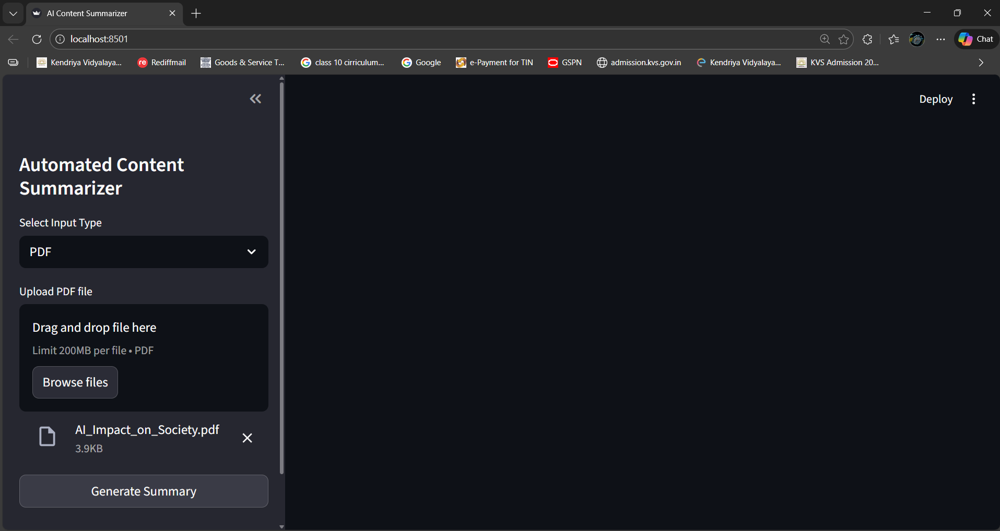
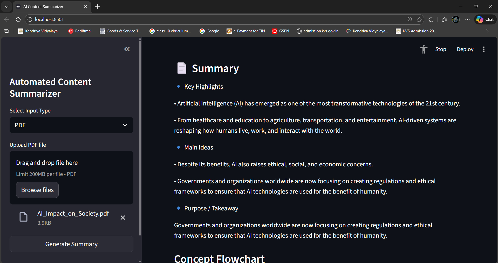
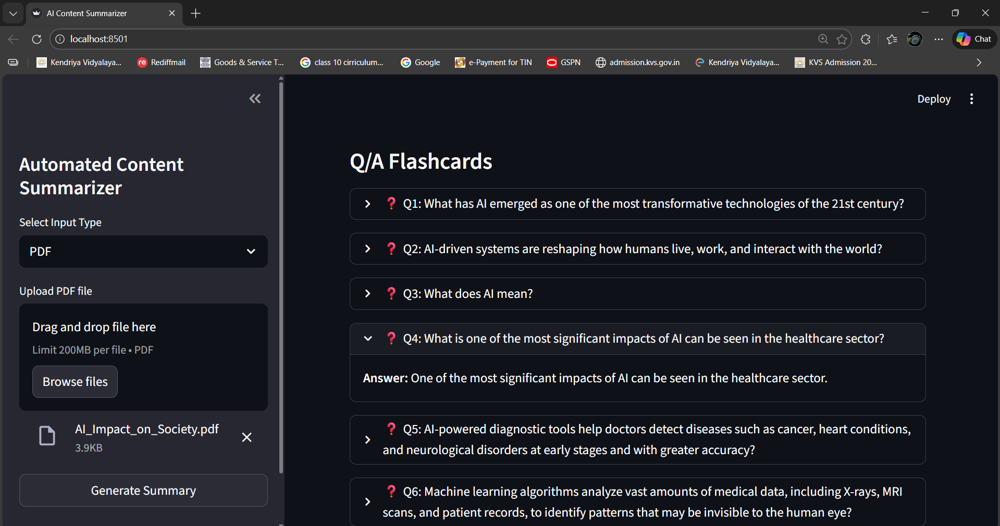

# 📌 AI-Content-Summarizer

**AI-Content-Summarizer** is a Python-based AI application that summarizes content from **text, PDF, images, and videos** into concise and meaningful summaries. It is designed to reduce reading time and improve content understanding using modern AI models.

---

## 📷 Screenshots

### 🖼️ Application Interface


### 🖼️ Summary Output



---

## ✨ Features

✔️ Text summarization  
✔️ PDF document summarization  
✔️ Image text extraction & summarization  
✔️ YouTube / Video caption-based summarization  
✔️ Flashcards generation  
✔️ Streamlit-based interactive UI  

---

## 🧪 Tech Stack

- **Python**
- **Streamlit**
- **OpenAI API**
- **Whisper (optional for audio)**
- **NLP & ML models**
- **PDF / Image Processing Libraries**

---

## 🚀 Getting Started

### 1️⃣ Clone the repository

```bash
git clone https://github.com/Palwinder-1804/AI-Content-Summarizer.git
cd AI-Content-Summarizer

```

### 2️⃣ Create a virtual environment (optional but recommended)

```bash
python -m venv venv
source venv/bin/activate     # Linux / macOS
venv\Scripts\activate        # Windows
```
### 3️⃣ Install dependencies

```bash
pip install -r requirements.txt
```
## 🔑 API Configuration (Important)

This project uses **OpenAI APIs** for content summarization and flashcard generation in videos section.

---

### Step 1: Get Your OpenAI API Key

1. Visit 👉 https://platform.openai.com/
2. Log in to your account
3. Generate a new **API Key**

---

### Step 2: Set API Key as an Environment Variable

#### 🔹 Windows (PowerShell)
```powershell
setx OPENAI_API_KEY "your_api_key_here"
```
#### ⚠️ Restart the terminal after running this command.

#### 🔹 macOS / Linux

``` bash
export OPENAI_API_KEY="your_api_key_here"
```
### Step 3: (Optional) .env File Setup
```env
OPENAI_API_KEY=your_api_key_here
```
#### ✅ Make sure .env is added to .gitignore to keep your API key secure.
#### 🔒 Never commit your API key to GitHub or share it publicly.

## ▶️ Run the Application

### Streamlit (original UI)
``` bash
streamlit run app.py
```

Open: http://localhost:8501

---

### Flask API (if you prefer the HTTP API)
If you added or want to run the Flask app (the repo includes an example `app.py` HTTP server), run:
```bash
python app.py
```
Open: http://localhost:5000/  (health) or POST to `/api/text`, `/api/pdf`, `/api/image`, `/api/video` as JSON/multipart described in the code


---
## 🧠 How It Works

 1. User selects input type (Text / PDF / Image / Video).
 2. Content is extracted and cleaned.
 3. AI model processes the content. 
 4. Summary and flashcards are generated and displayed in real time.
---


